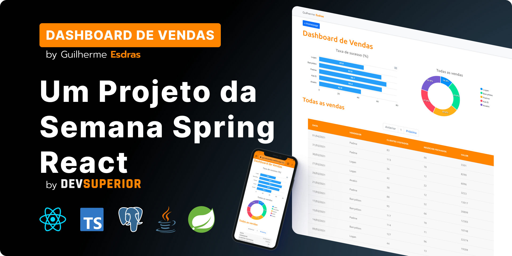

# Projeto SDS - Gui Vendas

> This is the *monorepo (frontend + backend repos)* of **Gui Vendas** project!

  
   
    A Full Stack Project developed with Java + Spring + PostgreSQL on Back End and TypeScript + React.JS on Front End during the DevSuperior's bootcamp "Semana Spring React (<em>Spring React Week</em>)"!
   
   
  <em>Click on each project's folders to see their particular README!</em> 😃👍
   
  <a href="backend">backend</a> • <a href="frontend">frontend</a>

## Live Preview

To view this project live, visit: https://esdras.dev/projects/guisales

## Contributing

Contributions are always welcome!

## Authors

- [@guilhermeesdras](https://www.github.com/GuilhermeEsdras)
- [@devsuperior]()

### Certified

[Click here](https://learn.devsuperior.com/certificados/1836928) to view my certified of this bootcamp conclusion.

## License

[MIT](https://choosealicense.com/licenses/mit/)

